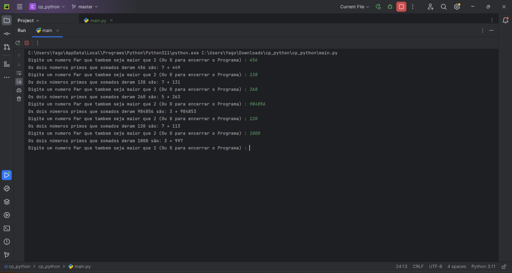

# Conjectura de Goldbach

## Sobre a conjectura
A Conjectura de Goldbach afirma que  todo número par maior que 2 pode ser expresso como a soma de dois números primos, como o exemplo abaixo:

* 4 = 2 + 2 
* 6 = 3 + 3 
* 8 = 3 + 5 
* 10 = 5 + 5 
* 12 = 5 + 7 
* 52 = 5 + 47 
* 1000 = 3 + 997

A famosa conjectura de Goldbach é um dos problemas mais antigos não resolvidos da matemática e apesar de não ter sido provada até hoje, a conjectura funcionou para todos os casos que foram testados. 

## Descrição do projeto
O código implementa um algoritmo utilizando a linguagem de programação python que testa a Conjectura de Goldbach para números pares acima de 2. O algoritmo é eficiente e pode ser usado para testar números pares.

## Como executar o programa
1. Tenha uma IDE do seu gosto ou utilize o terminal do seu sistema operacional para rodar o código
2. Faça uma fork do projeto ou clona o mesmo em seu repositorio remote
3. O codigo executado deverá ser o main pois é o codigo fonte do projeto e lá toda a logica está sendo representada
4. A conjectura será feita apenas para numeros pares acima de 2 então voce deverá digitar um numero de acordo
5. Caso queira parar a execução do programa digite o numero 0 (zero).
6. O codigo será executado enquanto o usuario digitar qualquer numero que não seja 0 (zero)

## Codigo em execução

## Equipe de Desenvolvedores
Yago Lucas Gonçalves da Silva
